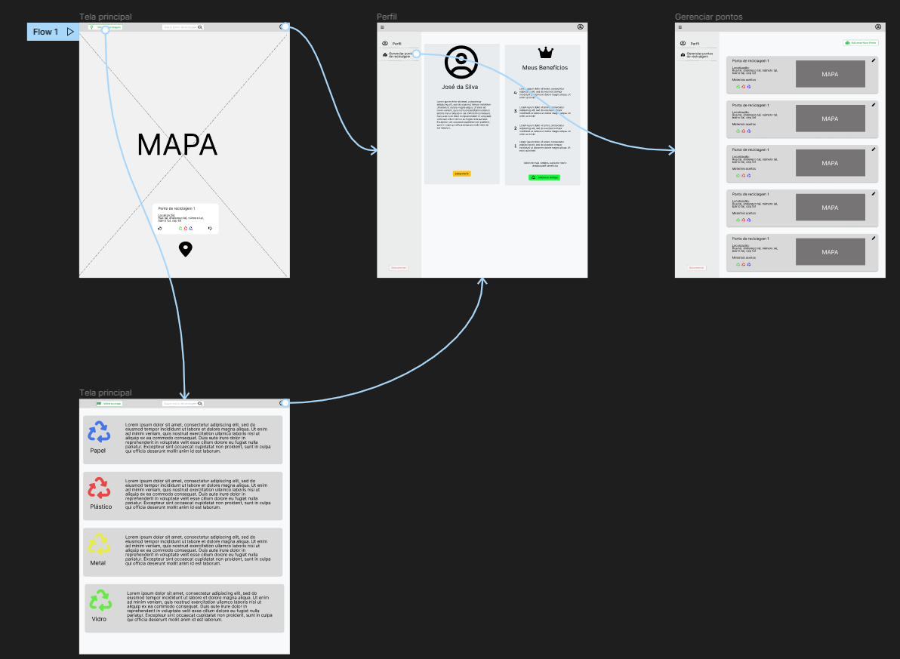

# Informações do Projeto
`TÍTULO DO PROJETO`  

Ponto de Reciclagem

`CURSO` 

Sistemas de Informação

## Participantes

>
> Os membros do grupo são: 
> - Marcos Reider Rosado
> - Humberto Roosevelt Figueredo Junior
> - Gabriel Rodrigues Martins
> - Letícia Ferreira Barbosa
> - Willian Marques Silva
> - Arthur Santos Bezerra
> - Lucas Rezende Bortone

# Estrutura do Documento

- [Informações do Projeto](#informações-do-projeto)
  - [Participantes](#participantes)
- [Estrutura do Documento](#estrutura-do-documento)
- [Introdução](#introdução)
  - [Problema](#problema)
  - [Objetivos](#objetivos)
  - [Justificativa](#justificativa)
  - [Público-Alvo](#público-alvo)
- [Especificações do Projeto](#especificações-do-projeto)
  - [Personas e Mapas de Empatia](#personas-e-mapas-de-empatia)
  - [Histórias de Usuários](#histórias-de-usuários)
  - [Requisitos](#requisitos)
    - [Requisitos Funcionais](#requisitos-funcionais)
    - [Requisitos não Funcionais](#requisitos-não-funcionais)
  - [Restrições](#restrições)
- [Projeto de Interface](#projeto-de-interface)
  - [User Flow](#user-flow)
  - [Wireframes](#wireframes)
- [Metodologia](#metodologia)
  - [Divisão de Papéis](#divisão-de-papéis)
  - [Ferramentas](#ferramentas)
  - [Controle de Versão](#controle-de-versão)
- [**############## SPRINT 1 ACABA AQUI #############**](#-sprint-1-acaba-aqui-)
- [Projeto da Solução](#projeto-da-solução)
  - [Tecnologias Utilizadas](#tecnologias-utilizadas)
  - [Arquitetura da solução](#arquitetura-da-solução)
- [Avaliação da Aplicação](#avaliação-da-aplicação)
  - [Plano de Testes](#plano-de-testes)
  - [Ferramentas de Testes (Opcional)](#ferramentas-de-testes-opcional)
  - [Registros de Testes](#registros-de-testes)
- [Referências](#referências)

# Introdução

## Problema

 A reciclagem tem como ponto principal a coleta de certos materiais do lixo que podem ser reutilizados na fabricação de produtos, diminuindo a produção do consumo de lixo.

  A falta de informações sobre esse reaproveitamento ainda é menor que o esperado, resultando em poucos focos de coleta especializados, ambientes sujos e inadequados para o tratamento dos rejeitos como os lixões.

 Com isso, o ponto de reciclagem ajudaria seus usuários a encontrarem o ponto de coleta mais perto de si, contribuindo para locais mais limpos e consumo consciente.

## Objetivos
  O objetivo geral neste trabalho é fazer um site em que tenha informação sobre o processo de reciclagem e que ele indique locais para que as pessoas possam reciclar os materiais que estejam usados e parado ou já não será mais utilizados; é fazendo isso as pessoas vão está ajudando o meio ambiente e irá acumulado pontos no site para ganhar recompensa.
 
· Objetivo específico seria ajuda na limpeza de casa e ruas visando que as pessoas aprendam a descartar corretamente os materiais não utilizados mais.
 
· Melhor o seu ambiente , deixando ele mais limpo e organizado para beneficiar seu lar , rua e etc.

## Justificativa

Um sistema que agrega pontos de reciclagem em um mapa pode ser muito útil para incentivar a reciclagem e ajudar as pessoas a encontrar pontos de coleta mais próximos de suas casas ou locais de trabalho. Além disso, um sistema de gamificação e pontos pode tornar a reciclagem mais divertida e envolvente, incentivando as pessoas a reciclar mais e com mais frequência.

A importância de um sistema assim é que ele pode ajudar a reduzir o desperdício e a poluição, além de ajudar a preservar os recursos naturais do planeta. A reciclagem é uma das maneiras mais eficazes de reduzir o impacto ambiental do lixo e um sistema que agrega pontos de reciclagem em um mapa pode ajudar a torná-la mais acessível e fácil para todos.

Para isso o sistema usará um sistema colaborativo para cadastro e manutenção dos pontos de reciclagem informados, afim de abranger mais cidades e pontos de reciclagem.

O sistema colaborativo de coleta de dados é uma ótima maneira de envolver os usuários na criação e manutenção de uma base de dados precisa e atualizada. Além disso, a avaliação dos dados cadastrados pelos próprios usuários pode ajudar a garantir a qualidade dos dados e a identificar possíveis erros ou inconsistências. Isso pode ser particularmente útil em projetos que envolvem grandes quantidades de dados ou que precisam ser atualizados regularmente.

Algumas razões para criar um sistema assim incluem:
- Ajudar as pessoas a encontrar pontos de coleta mais próximos de suas casas ou locais de trabalho;
- Incentivar as pessoas a reciclar mais e com mais frequência;
- Tornar a reciclagem mais divertida e envolvente;
- Reduzir o desperdício e a poluição;
- Preservar os recursos naturais do planeta.

## Público-Alvo

O público alvo abrange uma diversidade de pessoas que geralmente tem uma preocupação mínima com o meio ambiente. Isto engloba pessoas de todas as idades, de crianças à idosos. Pessoas que tem lixo acumulado que desejam reciclar a pessoas que tem pouco lixo porém buscam contribuir de alguma forma com o meio ambiente. Há também casos de pessoas que podem exercer alguma atividade relacionada com a produção de lixo como fábricas, trabalhos industriais e etc.

O público específico de interesse da aplicação é o residente em todas as regiões do Brasil. Englobando pessoas de ambos os sexos e todas as idades. Pessoas com hábitos de vida de todas as formas e todos os nichos sociais.

# Especificações do Projeto

Aqui serão elaboradas as especificações do projeto, incluindo as funcionalidades, personas e mapa de empatia,
wireframe, fluxos de navegação, requisitos e restrições do sistema.

## Personas e Mapas de Empatia

......  COLOQUE AQUI O SEU TEXTO ......

 José da Silva Matos 
 Mapa Empatia 
 
 Maria de Lourdes 
 Mapa Empatia 
 
 Maria Luiza Castro 
 Mapa Empatia 
 
 Gabriel Soares Almeia 
 Mapa Empatia 
 
 Matheus de Albuquerque 
 Mapa Empatia 

## Histórias de Usuários

Com base na análise das personas forma identificadas as seguintes histórias de usuários:

|EU COMO... `PERSONA`| QUERO/PRECISO ... `FUNCIONALIDADE` | PARA ... `MOTIVO/VALOR`                                                       |
|--------------------|------------------------------------|-------------------------------------------------------------------------------|
|Usuário do sistema  | Consultar pontos de reciclagem     | Saber onde entregar os materiais                                              |
|Usuário do sistema  | Avaliar pontos de reciclagem       | Colaborar com o sistema indicando onde é um bom local para entregar materiais |
|Usuário do sistema  | Criar pontos de reciclagem         | Colaborar com o sistema indicando onde é possível entregar materiais          |
|Usuário do sistema  | Resgatar pontos                    | Ser recompensado por minhas entregas                                          |

## Requisitos

As tabelas que se seguem apresentam os requisitos funcionais e não funcionais que detalham o escopo do projeto.

### Requisitos Funcionais

| ID     | Descrição do Requisito                                                             | Prioridade |
|--------|------------------------------------------------------------------------------------|------------|
| RF-001 | Permitir que o usuário se cadastre no sistema                                      | ALTA       | 
| RF-002 | Permitir que o usuário faça login no sistema                                       | ALTA       |
| RF-003 | Permitir que o usuário visualize os pontos no mapa sem estar logado                | ALTA       |
| RF-004 | Permitir que o usuário logado avalie um ponto de coleta                            | MEDIA      |
| RF-005 | Permitir que o usuário logado cadastre novos pontos de coleta                      | MEDIA      |
| RF-006 | Permitir a edição das informações de usuário                                       | MEDIA      |
| RF-007 | Permitir que o usuário insira um código para adquirir pontos                       | MEDIA      |
| RF-008 | Ter um mapa com pontos de coleta                                                   | ALTA       |
| RF-009 | Ter sistema de níveis e benefícios no perfil do usuário                            | MEDIA      |
| RF-009 | O sistema deve fornecer dicas de reciclagem (como quais materiais são recicláveis) | MEDIA      |

### Requisitos não Funcionais

| ID      | Descrição do Requisito                                            | Prioridade |
|---------|-------------------------------------------------------------------|------------|
| RNF-001 | O sistema deve ser responsivo para rodar em um dispositivos móvel | MÉDIA      | 
| RNF-002 | Deve processar requisições do usuário em no máximo 3s             | BAIXA      | 
| RNF-003 | O sistema será exclusivamente Web                                 | ALTA       | 

## Restrições

O projeto está restrito pelos itens apresentados na tabela a seguir.

|ID| Restrição                                             |
|--|-------------------------------------------------------|
|01| O projeto deverá ser entregue até o final do semestre |
|02| Não será desenvolvido um módulo de backend            |

# Projeto de Interface

A interface do sistema consistirá em um mapa principal onde serão mostrados os pontos
de reciclagem de uma região.

O usuário poderá editar seu perfil e visualizar seus benefícios adquiridos conforme vai adicionando novos códigos
promocionais.

Também será possível fazer a gestão dos pontos de reciclagem cadastrados pelo próprio usuário.

## User Flow

> 

## Wireframes

> Tela principal
> 
> 
> 
>  Tela de dicas
> 
> 
> 
> Tela de perfil e benefícios
> 
> 
> 
> Tela de gestão de pontos de reciclagem
> 
> 

# Metodologia

O projeto será desenvolvido utilizando a metodologia ágil Scrum, fazendo uso do trello
para gerenciamento de tarefas e Discord para realizar os sprints.

## Divisão de Papéis

Todos os membros são responsáveis por todas as tarefas do projeto, incluindo a documentação, 
desenvolvimento e testes.

## Ferramentas

| Ambiente              | Plataforma       | Link de Acesso                                                     |
|-----------------------|------------------|--------------------------------------------------------------------|
| Scrum e planejamento  | Trello           | https://trello.com                                                 | 
| Repositório de código | GitHub           | https://github.com                                                 |
| Prototipagem          | Figma            | https://figma.com                                                  | 
| Desenvolvimento       | VSCode, Webstorm | https://code.visualstudio.com/ https://www.jetbrains.com/webstorm/ | 
| Reuniões              | Discord          | https://discord.com                                                | 

## Controle de Versão

O controle de versão será feito utilizando o Git, hospedado no GitHub.
Cada desenvolvedor terá um branch onde serão feitos os commits, os componentes serão agregados durante o projeto.

# Projeto da Solução

## Tecnologias Utilizadas

O sistema foi desenvolvido utilizando html e bootstrap, o mapa foi gerenciado pelo leaflet
e o backend feito em JS utilizando o localstorage

# Avaliação da Aplicação

......  COLOQUE AQUI O SEU TEXTO ......

> Apresente os cenários de testes utilizados na realização dos testes da
> sua aplicação. Escolha cenários de testes que demonstrem os requisitos
> sendo satisfeitos.

## Plano de Testes

......  COLOQUE AQUI O SEU TEXTO ......

> Enumere quais cenários de testes foram selecionados para teste. Neste
> tópico o grupo deve detalhar quais funcionalidades avaliadas, o grupo
> de usuários que foi escolhido para participar do teste e as
> ferramentas utilizadas.
> 
> **Links Úteis**:
> - [IBM - Criação e Geração de Planos de Teste](https://www.ibm.com/developerworks/br/local/rational/criacao_geracao_planos_testes_software/index.html)
> - [Práticas e Técnicas de Testes Ágeis](http://assiste.serpro.gov.br/serproagil/Apresenta/slides.pdf)
> -  [Teste de Software: Conceitos e tipos de testes](https://blog.onedaytesting.com.br/teste-de-software/)

## Ferramentas de Testes (Opcional)

......  COLOQUE AQUI O SEU TEXTO ......

> Comente sobre as ferramentas de testes utilizadas.
> 
> **Links Úteis**:
> - [Ferramentas de Test para Java Script](https://geekflare.com/javascript-unit-testing/)
> - [UX Tools](https://uxdesign.cc/ux-user-research-and-user-testing-tools-2d339d379dc7)

## Registros de Testes

......  COLOQUE AQUI O SEU TEXTO ......

> Discorra sobre os resultados do teste. Ressaltando pontos fortes e
> fracos identificados na solução. Comente como o grupo pretende atacar
> esses pontos nas próximas iterações. Apresente as falhas detectadas e
> as melhorias geradas a partir dos resultados obtidos nos testes.

# Referências

......  COLOQUE AQUI O SEU TEXTO ......

> Inclua todas as referências (livros, artigos, sites, etc) utilizados
> no desenvolvimento do trabalho.
> 
> **Links Úteis**:
> - [Formato ABNT](https://www.normastecnicas.com/abnt/trabalhos-academicos/referencias/)
> - [Referências Bibliográficas da ABNT](https://comunidade.rockcontent.com/referencia-bibliografica-abnt/)
